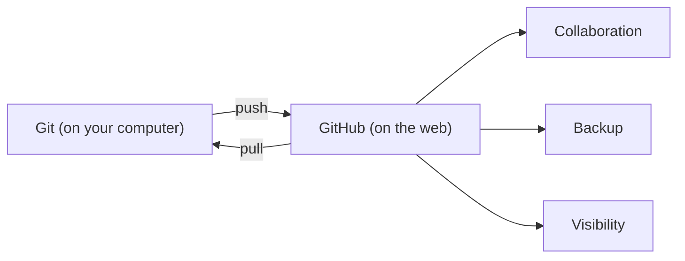

# Understanding the Problem GitHub Solves

> **Key question**: Why do millions of people use GitHub, and what would go wrong without it?

## Context

You have almost certainly experienced this:

```
report.docx
report_v2.docx
report_v2_FINAL.docx
report_v2_FINAL_reviewed.docx
report_v2_FINAL_reviewed_ACTUAL_FINAL.docx
```

This is a version control problem. You need to track changes over time, but your tools do not help you do it. You resort to naming conventions that quickly become meaningless. Which file is actually the latest? What changed between "reviewed" and "ACTUAL_FINAL"? If you need to undo something from three versions ago, how do you find it?

Now imagine this problem multiplied across a team. Five people editing the same document. Someone overwrites someone else's work. Two people make conflicting changes at the same time. Nobody knows which version is the "real" one. This is the chaos that version control systems were invented to eliminate.

## The Core Idea

**Git** is a version control system. It tracks every change ever made to a set of files, who made each change, and when. Think of it as an infinite undo history with annotations. Every save point (called a **commit**) is a snapshot of your entire project at that moment.

**GitHub** is a website that hosts Git projects online and adds collaboration features on top. The relationship is like the difference between a document and Google Docs — Git is the technology that tracks versions, and GitHub is the platform that makes it social, shareable, and visible.



## How It Works

GitHub solves three core problems. Understanding these helps you see why it matters even if you never write code.

### Problem 1: Tracking Changes Over Time

Every time you save a meaningful change in Git, you write a short message describing what you did. Git records the exact changes (which lines were added, modified, or removed), the timestamp, and who made them. You can view the complete history, compare any two points in time, or roll back to any previous state.

This is not just "undo". It is a full audit trail. You can answer questions like "who changed this paragraph and why?" or "what did this file look like three weeks ago?"

### Problem 2: Working Together Without Conflicts

When multiple people work on the same project, Git lets each person work on their own copy. They make changes independently, then merge their work together. If two people change different parts, Git combines the changes automatically. If two people change the same part, Git flags the **conflict** and asks a human to decide which version to keep.

This means no more emailing files back and forth, no more "don't edit this while I'm working on it", and no more accidentally overwriting someone else's work.

### Problem 3: A Single Source of Truth

GitHub provides one central place where the current, official version of a project lives. Everyone on the team can see the latest version, the full history, and any proposed changes. There is no ambiguity about which copy is "the real one".

This is why GitHub has become the standard for software development — and increasingly for other kinds of collaborative work, including writing, design, data science, and even legal documents.

## Trade-offs and Alternatives

Git is not the only version control system, but it is by far the most popular. Alternatives include Subversion (SVN) and Mercurial, but they have much smaller communities. GitHub is not the only Git hosting platform either — GitLab and Bitbucket offer similar services. GitHub won the popularity contest through good design, a strong community, and Microsoft's backing (they acquired GitHub in 2018).

The main trade-off with Git is complexity. Git was designed for large-scale software projects and has a notoriously steep learning curve. For our purposes, you only need a small fraction of what Git can do — and GitHub's web interface handles most of it visually.

## Common Misconceptions

**"GitHub is only for programmers."**
GitHub started with code, but it hosts any kind of file. People use it for recipes, legal documents, government policy, academic papers, and more. If something changes over time and benefits from version tracking, GitHub can handle it.

**"Git and GitHub are the same thing."**
Git runs on your computer and tracks changes locally. GitHub is a website that stores your Git projects online and adds features like issue tracking, pull requests, and team management. You can use Git without GitHub, but most people use them together.

**"You need to use the command line."**
While developers often use Git through a terminal, GitHub's web interface lets you do most things with point-and-click. For learning, we will use the web interface exclusively.

## Connections

This understanding forms the foundation for everything that follows. In the next module, you will create your first GitHub repository and experience version tracking firsthand. Later, when we get to Claude Code, you will see how an AI agent uses Git to track its own changes — making commits, creating branches, and even opening pull requests.

The concept of a "single source of truth" will also reappear in Section 3 when we talk about context engineering. Just as GitHub gives a team one place to find the real version, a `CLAUDE.md` file gives an AI agent one place to find its instructions.

## Knowledge Check

1. What is the main difference between Git and GitHub?
   - A) Git is the old version and GitHub is the new version
   - B) Git tracks changes locally; GitHub hosts projects online and adds collaboration
   - C) Git is free and GitHub costs money
   - D) There is no difference — they are different names for the same thing

2. In your own words, describe one real-world situation (not involving code) where version tracking would prevent a problem.

## Further Reading

- [Your First Repository](./1.2-your-first-repository.md) — create and interact with a real GitHub repository
- [Branches and Pull Requests](./1.3-branches-and-pull-requests.md) — learn how teams collaborate without conflicts
