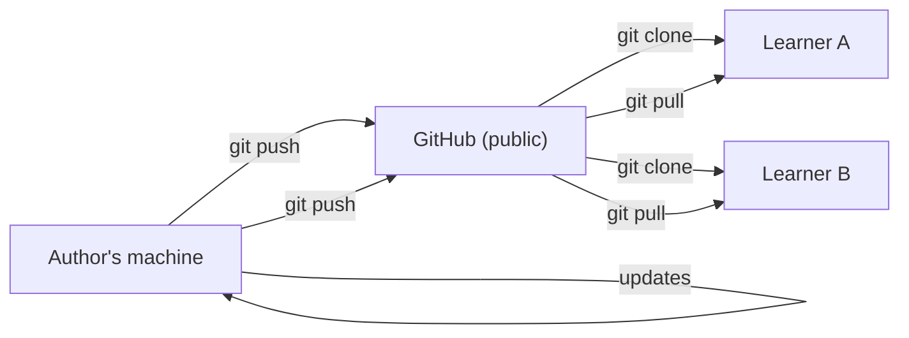

# Understanding the Problem GitHub Solves

> **Key question**: How did you get this curriculum — and how will you get improvements to it?

## The Distribution Problem

You got this curriculum by running one command:

```bash
git clone https://github.com/doyeongk/Learn-Agentic-Engineering-In-Claude.git
```

That pulled every file — content, skills, commands, the whole site — onto your machine. Now suppose a module gets rewritten next week. How does that reach you?

Without GitHub, the options are messy: email the updated files to everyone (who has the list? what if they miss it?), post a new download and ask people to start over (their progress is gone), or post a changelog and ask people to apply changes manually. None of these send only the lines that changed, with a record of what changed and why.

`git pull` handles it. It fetches exactly the diff since your last update. If you have added your own notes to a file and that file gets an update upstream, Git will usually merge both changes cleanly. You get the new content; you keep your annotations.

This project is on GitHub because that is the right tool for distributing files that evolve to people you have never met.

## Git vs GitHub

**Git** is a version control system that runs on your computer. It tracks every change ever made to a set of files — who changed what, when, and why. Every save point is called a **commit**, and you can rewind to any of them.

**GitHub** is a website that hosts Git repositories online. Git is the engine; GitHub is what lets a stranger run `clone` and get a complete, up-to-date copy.



The commit history is also what makes updates legible. When a module changes, you can read the diff and the commit message rather than receiving a new file and being told it is better now.

## Why This Matters Later

When Claude Code modifies files on your behalf, Git is your safety net. Before an agent starts a task, it is worth having a clean commit so that if the result is not what you wanted, you can revert cleanly. The agent may check `git status` and flag uncommitted changes before proceeding for exactly this reason.

## Trade-offs

Git was designed for large software projects and is genuinely complex. For this course you need `clone` to get started and `pull` to stay current — a small fraction of what it can do.

GitLab and Bitbucket offer equivalent hosting. GitHub has a larger community and is where most open-source projects live, which is why it is the default.

## Knowledge Check

- A learner cloned this repo six months ago. Three modules were rewritten since then. What command do they run, and what exactly gets transferred?
- Why does the commit history matter beyond just keeping a backup?

## Further Reading

- [Your First Repository](./1.2-your-first-repository.md) — create a repo and make your first commit
- [Branches and Pull Requests](./1.3-branches-and-pull-requests.md) — how teams collaborate without conflicts
