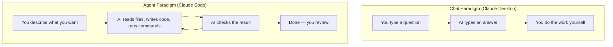

# Understanding the Shift from Chat to Agent

> **Key question**: What changes when an AI can do things on your computer, not just talk about them?

## Context

If you have used Claude Desktop (or ChatGPT, or Gemini), you know the pattern. You type a question, the AI types an answer. The conversation is useful, but it stays inside a chat window. Nothing happens in the real world — unless you go and do it yourself.

This is the **chat paradigm**. The AI can think, explain, and suggest, but it cannot act. Ask it to rename a file and it will tell you the command. Ask it to check your code and it will examine whatever you paste in — but it cannot open your project itself. The boundary between "AI talks" and "human does" is fixed.

Claude Code removes that boundary.

## The Core Idea

Claude Code is an **AI agent**. An agent is an AI that can use tools to take actions in the real world — read files, write code, run commands, search the web, and modify your project. It does not just tell you what to do; it does the work, checks the result, and adjusts if something went wrong.

The mental model that works best: **Claude Code is like a capable junior colleague sitting at your computer.** You describe what you want in plain English, and they carry it out using the same tools you would — a text editor, a terminal, a file browser, a web search. They ask clarifying questions when your instructions are ambiguous. They show you what they are about to do before taking risky actions (like deleting files). And they make mistakes sometimes, just like a real junior colleague would.

This shift has been described by AI researcher Andrej Karpathy as the move from **implementer to orchestrator**. Instead of writing every line of code yourself, you describe the outcome you want and supervise the agent as it works. Your job changes from doing the mechanical work to providing direction, reviewing results, and making judgment calls.

## How It Works

The practical difference shows up immediately. In Claude Desktop, if you want to understand a project, you manually open files, copy their contents, paste them into the chat, and ask questions. You are the messenger between the AI and your computer.

In Claude Code, you say "describe this project's structure" and the agent reads the files itself. It uses `Glob` to find files, `Read` to open them, and `Grep` to search for content. It builds its own understanding by exploring.

This changes what is *possible*. A chat AI is limited to whatever you think to paste in. An agent can discover things you did not know to look for — a forgotten configuration file, an inconsistency across two files, a failing test you had not run.

The key capabilities that make Claude Code an agent:

- **File operations**: reading, writing, editing, searching, and finding files
- **Command execution**: running terminal commands (build scripts, tests, package managers)
- **Web access**: searching the internet and fetching documentation
- **Multi-step reasoning**: chaining actions to accomplish complex goals, adjusting as it goes

:::tip
You do not need to know how these tools work internally. Describe what you want in plain English and Claude Code chooses the right tools.
:::

## Trade-offs and Alternatives

The agent paradigm is powerful, but it comes with different trade-offs compared to chat.

**Trust and verification** become more important. When an AI can act on your files, you need to stay engaged as a reviewer. Claude Code mitigates risk with a permission system, but attention matters.

**Precision of instructions** matters more. A vague instruction might lead to real changes you did not intend. Learning to give clear instructions is a core skill (covered in Section 3).

**Scope of mistakes** is different. A chat AI's mistakes stay in the chat. An agent's mistakes appear in your files — which is why Claude Code integrates tightly with Git.

## Common Misconceptions

**"Claude Code is just a fancier ChatGPT."**
This misses the fundamental difference. ChatGPT and Claude Desktop are chatbots — they process text and produce text. Claude Code is an agent — it processes text and produces *actions*. The underlying language model is similar, but the architecture around it (tools, file access, command execution) creates a categorically different experience.

**"You need to be a programmer to use Claude Code."**
Claude Code runs in a terminal, which feels technical. But you interact with it in plain English. You do not need to know programming languages to say "create a website with a blue header and three columns". The terminal is just the interface — the conversation is natural language, same as Claude Desktop.

**"The AI does everything perfectly on the first try."**
Agents work iteratively. Claude Code will often try something, notice an error, and fix it — just like a human would. This is a feature, not a bug. Expecting one-shot perfection leads to frustration; expecting an iterative process leads to good results.

## Connections

This paradigm shift is the foundation for the rest of this curriculum. In the next module, you will experience it firsthand by running Claude Code and watching it explore this very project. In Section 3, you will learn how to give agents better instructions through context engineering. And in Section 4, you will build custom skills and workflows that extend what the agent can do.

Understanding the chat-to-agent shift also connects back to Section 1. Git and GitHub matter more when an AI is making changes to your project — version control becomes your safety net, and pull requests become your review mechanism.

## Knowledge Check

1. What is the primary difference between a chat AI and an AI agent?
   - A) An agent uses a newer language model
   - B) An agent can use tools to take actions, not just generate text
   - C) An agent is always correct
   - D) An agent does not need human input

2. In your own words, explain what it means to shift from "implementer" to "orchestrator" when working with an AI agent.

## Further Reading

- [Your First Session](./2.2-your-first-session.md) — experience Claude Code firsthand by exploring this project
- [The Agentic Loop](./2.3-the-agentic-loop.md) — understand the cycle that makes agents effective
