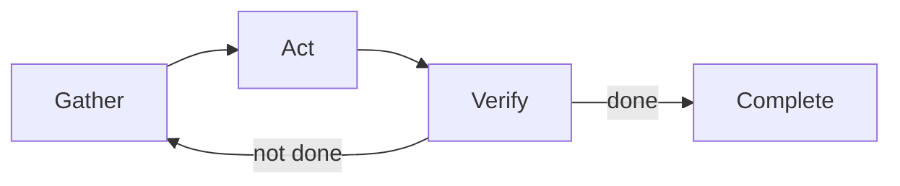

# Understanding the Agentic Loop

> **Key question**: How does an AI agent break down and complete complex tasks that cannot be done in a single step?

## Context

In Module 2.2, you watched Claude Code read files, search directories, and create a file. What you may not have noticed is the *pattern* behind those actions. Claude Code was not executing a script. It was running a loop: gather information, act, check the result, repeat. This loop is the engine that drives every AI agent.

## The Core Idea

The **agentic loop** is a cycle with four phases:

1. **Gather** — Collect information needed for the task. Read files, search for patterns, ask the user a question.
2. **Act** — Take a concrete step toward the goal. Write a file, run a command, edit some code.
3. **Verify** — Check whether the action succeeded. Read the output, run tests, look for errors.
4. **Repeat** — If the task is not complete, go back to step 1 with new information.



This is not unique to AI. It is the same cycle a human follows when working on any non-trivial task. You research, try something, check if it worked, and adjust. The difference is that an AI agent runs this loop using programmatic tools — file reads instead of eyeballs, terminal commands instead of mouse clicks.

The loop is what separates an agent from a chatbot. A chatbot runs one pass: input in, output out. An agent runs *many* passes, each building on the results of the previous one.

## How It Works

Let us trace the agentic loop through a realistic example. Suppose you ask Claude Code:

```text
Find all the markdown files in this project that mention "knowledge check" and tell me how many there are.
```

**Loop iteration 1 — Gather**: Claude Code uses its `Grep` tool to search for "knowledge check" across all `.md` files. The tool returns a list of matching files with line numbers.

**Loop iteration 1 — Act**: The agent counts the results and prepares a summary.

**Loop iteration 1 — Verify**: The result is straightforward — the search either worked or produced an error. In this case, it worked. The task is complete in a single iteration.

That was a single-loop task. Now consider something harder:

```text
Add a knowledge check section to any module file that is missing one.
```

This triggers multiple loops: first, gather all module files and check which have the section. Then, for each file missing it, read the content, write appropriate questions, and verify the edit. Five files missing the section means five loops of gather-act-verify.

The key insight: **complex tasks are not done in one shot.** They decompose into smaller steps, each running through the cycle. The agent reads its own output, detects errors, and adjusts — that is what makes it effective.

### Tools as Hands

The tools available to an agent determine what it can do in the "act" phase. Think of tools as the agent's hands — without them, it can only think and talk.

Claude Code's tools let it:
- **See** the project (`Glob`, `Grep`, `Read`)
- **Change** the project (`Write`, `Edit`)
- **Execute** commands (`Bash`)
- **Research** online (`WebSearch`, `WebFetch`)
- **Orchestrate** complex work (`Task`)

The language model chooses which tool to use and what arguments to provide. This decision-making is what makes it an agent rather than a scripted pipeline.

### The Human in the Loop

You are part of the loop. Claude Code does not run unsupervised — it pauses at critical moments:

- **Before running commands**: It shows you the command and asks permission
- **Before writing files**: It shows you the proposed content
- **When uncertain**: It asks clarifying questions rather than guessing
- **Interruption**: You can press `Esc` at any time to stop the agent mid-loop

This means the loop is really: gather, plan, **check with human**, act, verify, repeat. Your role is to provide direction, approve actions, and catch mistakes. You are the quality control layer.

:::note
The level of human involvement is configurable. In default mode, Claude Code asks before every write and command. In auto-accept mode, it asks less often. Module 2.4 covers all the permission modes.
:::

## Trade-offs and Alternatives

The agentic loop is effective but not free. Each iteration takes time and uses API tokens. A task that a human could do in one deliberate step might take the agent three iterations of trial and error.

**When the loop works well**: Exploring unknown territory, checking multiple conditions, iterative refinement. The agent writes code, runs tests, fixes failures, repeats.

**When it is less efficient**: You already know the exact edit needed. Giving precise instructions skips the discovery phase.

The trade-off is **autonomy vs. efficiency**. More autonomy suits ambiguous tasks; exact instructions suit known ones.

## Common Misconceptions

**"It does everything in one shot."**
People expect one instruction to produce a perfect result. In reality, the agent might read a file, realise it needs more context, read another file, then start making changes. This iterative process is normal — it is how the agent handles complexity.

**"You need to give perfect instructions."**
"Make the tests pass" is a valid instruction. The agent will find the test files, run them, see what fails, and iterate. Overly detailed instructions can be counterproductive — they remove the agent's ability to adapt when it discovers something unexpected.

**"More loops means something is wrong."**
Multiple iterations often mean thoroughness, not struggle. The number of loop iterations is not a measure of quality; the final result is.

## Connections

The agentic loop underpins everything in Claude Code. In Section 3, you will learn context engineering — giving the agent better information so it gathers more efficiently and acts more accurately, reducing the iterations needed.

In Section 4, custom skills give the agent pre-built knowledge. They still run the loop, but start with better information.

Understanding the loop helps you debug. If Claude Code produces wrong results, the fix is usually better information in the "gather" phase — clearer instructions, better context, or a more precise goal.

## Knowledge Check

1. What are the four phases of the agentic loop?
   - A) Plan, code, test, deploy
   - B) Gather, act, verify, repeat
   - C) Read, write, edit, save
   - D) Input, process, output, store

2. In your own words, explain why complex tasks require multiple iterations of the loop rather than a single pass. Use an everyday analogy.

## Further Reading

- [Tools and Permissions](./2.4-tools-and-permissions.md) — the complete set of tools the agent uses in the "act" phase
- [From Chat to Agent](./2.1-from-chat-to-agent.md) — the paradigm shift that makes the agentic loop possible
