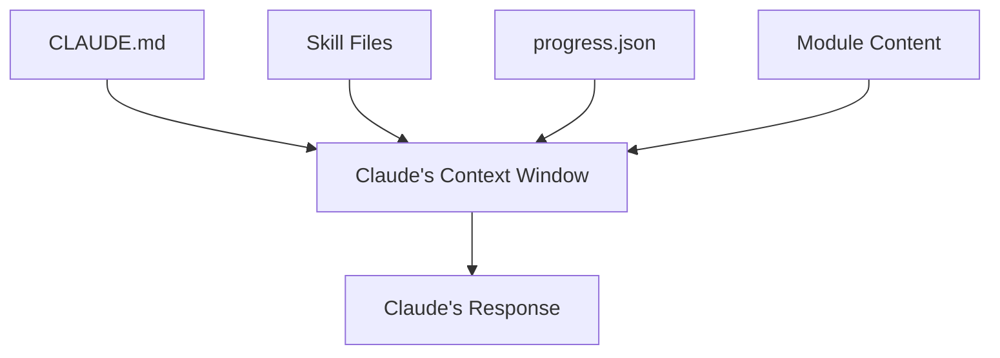

# Understanding Context

> **Key question**: What does an AI actually "see" when it responds to you, and how does that shape everything it does?

## Context

Here is something you may not have realised: every module you have completed in this curriculum was shaped by a file you never explicitly loaded. A file called `CLAUDE.md` has been sitting at the root of this project, quietly instructing Claude Code on how to behave — what conventions to follow, what architecture to respect, how to track your progress.

You did not write it. You did not ask for it. But it has been influencing every interaction since you started.

That file is **context**. And understanding context is the single most important skill for working with AI agents effectively.

## The Core Idea

When you send a message to an AI model, your message is not the only thing it sees. The model receives a bundle of information called the **context window**. This includes:

- Your current message
- The conversation history (previous messages in this session)
- System instructions (rules the model was given before you arrived)
- Files and data that have been loaded
- Tool results from previous actions

Everything the model knows, thinks about, and uses to generate its response comes from this bundle. There is no hidden memory, no secret knowledge beyond what is in the context window. If something is not in the context, the model does not know about it.

Think of it like briefing a new colleague on their first day. Whatever you put in the briefing document shapes how they approach every task. Leave out important context, and they will make reasonable but wrong assumptions. Include the right context, and they will behave exactly as you need.

## How It Works

### The Context Window Is Finite

Every AI model has a maximum context size — typically measured in **tokens** (roughly, pieces of words). Claude's context window is large (200,000 tokens, roughly the length of a novel), but it is still finite. This means you cannot just dump everything in and hope for the best.

This finite size creates a fundamental constraint: you must choose what goes in. And what you choose determines the quality of the output.

### Context Engineering vs Prompt Engineering

You may have heard of "prompt engineering" — the art of writing better prompts to get better results. Context engineering is a broader, more powerful idea.

**Prompt engineering** focuses on *how you ask the question*. Context engineering focuses on *what information the model has access to when answering*.

A perfectly worded prompt with poor context will give poor results. A roughly worded prompt with excellent context will give excellent results. The context matters more than the phrasing.

The real skill is not crafting clever prompts but engineering the context — assembling the right information, in the right format, at the right time.

### How This Project Uses Context

This learning project is a working example. When Claude Code starts a session in this project, it:

1. **Reads `CLAUDE.md`** — the project instructions file. This tells it about the architecture, commands, skills, conventions, and how progress tracking works.
2. **Loads relevant skills** — when a command runs (like the one delivering this module), it reads specific skill files that contain teaching procedures.
3. **Reads `progress.json`** — to know where you are in the curriculum, what you have completed, and what comes next.
4. **Reads the module content** — the actual material being taught.

Each of these is a piece of context. Together, they create a system that behaves consistently, tracks your progress, and delivers content in a specific way — all without anyone manually configuring each session.

## Trade-offs and Alternatives

The main trade-off is between comprehensiveness and focus. More context gives the model more to work with, but also more to get distracted by. The art is finding the minimum effective context — the smallest set of information that produces the best result.

For this project, the CLAUDE.md file is carefully structured. It does not include every possible instruction — it includes exactly what Claude Code needs to understand the project architecture, follow conventions, and deliver content. Nothing more.

Other approaches exist. Some people put instructions in conversation messages. Some use multiple files. Some rely entirely on the model's training. Each has trade-offs we will explore in Module 3.3.

## Common Misconceptions

**"The AI remembers previous conversations."**
It does not. Each Claude Code session starts fresh. The context window contains only the current session. If you want information to persist across sessions, it must live in files — like `CLAUDE.md` or `progress.json`. This is why those files exist.

**"More context is always better."**
More context means more to process, more potential for distraction, and more risk of the model losing focus on what matters. A 500-word CLAUDE.md with precisely the right information will outperform a 5,000-word CLAUDE.md full of tangential details.

**"The AI understands my project inherently."**
The model knows nothing about your project except what you put in its context. Without CLAUDE.md, Claude Code would not know this is a learning platform, would not know about the module system, and would not know how to track progress. Every capability comes from context.

## Connections

This module introduces the concept. Over the next four modules, you will go deeper:

- **Module 3.2** — examine and experiment with the very CLAUDE.md that has been shaping this project
- **Module 3.3** — learn why less is often more (signal vs noise)
- **Module 3.4** — practical techniques for managing context in long sessions
- **Module 3.5** — the full hierarchy of context files in Claude Code

In Section 4, you will learn how skills and subagents create targeted context — loading specific knowledge only when it is needed, rather than cluttering the main context window.

## Knowledge Check

1. What is the "context window" in an AI model?
   - A) The chat interface where you type messages
   - B) The complete bundle of information the model can see when generating a response
   - C) The model's long-term memory
   - D) The training data the model was built from

2. In your own words, explain why CLAUDE.md matters for this project. What would change if it were deleted?

## Further Reading

- [The CLAUDE.md You're Already Using](./3.2-the-claudemd-youre-already-using.md) — hands-on exploration of this project's context file
- [Signal, Noise, and the Attention Budget](./3.3-signal-noise-and-the-attention-budget.md) — why less context can mean better results
