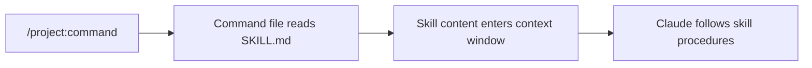

# Understanding Skills

> **Key question**: If CLAUDE.md gives Claude Code its general instructions, what gives it specialist knowledge?

## Context

Here is something you probably did not notice: the way each module has been delivered to you — the pacing, the knowledge checks, the progression — is not something Claude Code knows how to do by default. A skill file called `training-delivery` has been loaded every time a module command runs. That skill contains the procedures for how to teach: when to pause for questions, how to adapt to your level, when to offer encouragement, and how to check understanding.

The training-delivery skill has been teaching you this whole time. You just did not see it.

## The Core Idea

A **skill** is a reference document that gives Claude Code specialist knowledge for a specific task. It lives in `.claude/skills/` and is loaded on demand — only when a command or workflow needs it.

The key distinction:

- **CLAUDE.md** is always loaded. It contains instructions the agent needs for *every* interaction.
- **Skills** are loaded selectively. They contain instructions the agent needs for *specific* tasks.

Think of it like a professional's toolkit. CLAUDE.md is the general knowledge every employee has — company policies, project conventions, how things are organised. Skills are the specialist manuals they pull off the shelf when they need to do something specific — a style guide for writing, a checklist for code review, a procedure for onboarding.

This distinction matters because of the attention budget (Module 3.3). If you put everything in CLAUDE.md, the context window fills with information that is irrelevant to the current task. Skills solve this by keeping specialist knowledge out of the base context until it is needed.

## How It Works

### Anatomy of a Skill

Every skill has a `SKILL.md` entry point file. It may also have a `reference/` subdirectory with supporting documents. The structure looks like:

```
.claude/skills/
├── training-delivery/
│   ├── SKILL.md              # Entry point — procedures, rules
│   └── reference/
│       ├── delivery-flow.md   # Detailed delivery steps
│       └── engagement.md      # How to keep learners engaged
├── diataxis/
│   ├── SKILL.md              # Content classification framework
│   └── reference/
│       └── ...
└── frontend-design/
    └── SKILL.md              # UI generation guidelines
```

The `SKILL.md` file is the main document. It typically contains:

- **What the skill is for** — a clear description of when to use it
- **Procedures** — step-by-step instructions for how to accomplish the task
- **Rules** — constraints and requirements to follow
- **Examples** — concrete illustrations of correct behaviour

Reference files provide additional detail that the main SKILL.md can point to.

### Two Types of Skills

**Reference skills** provide knowledge — they describe how something works, what conventions to follow, or what a framework expects. The diataxis skill is a reference skill: it describes the four types of documentation and how to write each one.

**Task skills** provide procedures — they describe how to perform a specific task step by step. The training-delivery skill is a task skill: it contains the procedure for delivering a module to a learner.

### How Skills Get Loaded

Skills are not loaded automatically. They are loaded by commands — the slash command files in `.claude/commands/`. When you run a module command (e.g., `/project:3-1-what-is-context`), the command file tells Claude Code to read the training-delivery skill before delivering the module.

This is the loading chain:



The skill is only in the context window for the duration of that command. Start a new session or run a different command, and it is gone. This keeps the context lean.

### This Project's Four Skills

This learning project uses four skills:

| Skill | Type | Purpose |
|-------|------|---------|
| `training-delivery` | Task | How to deliver a module: pacing, engagement, knowledge checks |
| `diataxis` | Reference | The four types of documentation and how to write each one |
| `docusaurus` | Reference | MDX pitfalls, file naming, frontmatter conventions |
| `frontend-design` | Reference | UI design guidelines for generating the landing page |

Each serves a specific purpose and is loaded only when relevant. The training-delivery skill is loaded for every module delivery. The diataxis skill was loaded when generating module content. The frontend-design skill was loaded when generating the landing page. None of them clutter the base context.

## Trade-offs and Alternatives

**Skills vs CLAUDE.md**: If a piece of information is needed in every session, it belongs in CLAUDE.md. If it is needed only for specific tasks, it belongs in a skill. The test is simple: would loading this information for a task that does not need it be a waste of attention?

**Skills vs conversation instructions**: You could give Claude Code specialist instructions directly in conversation ("when writing documentation, follow the diataxis framework..."). Skills are better because they persist across sessions, are version-controlled, and can be reused by multiple commands.

**Skills vs web search**: For well-known frameworks, Claude Code can search the web. But skills are faster (no network call), more reliable (you control the content), and can be customised for your project's specific conventions.

## Common Misconceptions

**"Skills add new tools to Claude Code."**
Skills do not change what Claude Code *can* do. They change what it *knows*. A skill provides knowledge and procedures — it does not grant access to new tools or capabilities. Claude Code uses the same tools (Read, Write, Bash, etc.) regardless of which skills are loaded.

**"Skills are always loaded."**
Skills are loaded on demand, not automatically. If you start a Claude Code session without running a command that loads a skill, the skill's content is not in the context. This is by design — it keeps the base context lean.

**"Skills are the same as CLAUDE.md."**
CLAUDE.md and skills serve different purposes. CLAUDE.md is the foundation — always present, always active. Skills are specialist knowledge — present only when needed. Mixing them up leads to either a bloated CLAUDE.md or skills that duplicate base instructions.

## Connections

In Module 4.2, you will create your own skill from scratch. In Module 4.3, you will learn about subagents — isolated workers that can load their own skills. Module 4.5 brings everything together with a full architecture trace of how this project uses skills, commands, and context to create a complete learning system.

Understanding skills also deepens your context engineering knowledge from Section 3. Skills are a practical application of the attention budget concept — they keep specialist knowledge out of the base context until it is needed, preserving the signal-to-noise ratio.

## Knowledge Check

1. What is the main difference between CLAUDE.md and a skill file?
   - A) CLAUDE.md is for code, skills are for documentation
   - B) Skills are more important than CLAUDE.md
   - C) CLAUDE.md is always loaded; skills are loaded on demand for specific tasks
   - D) There is no difference — they work the same way

2. In your own words, explain why the training-delivery skill is loaded as a skill rather than being part of CLAUDE.md.

## Further Reading

- [Creating Your First Skill](./4.2-creating-your-first-skill.md) — build a skill from scratch
- [Signal, Noise, and the Attention Budget](../03-context-engineering/3.3-signal-noise-and-the-attention-budget.md) — the concept that makes skills valuable
