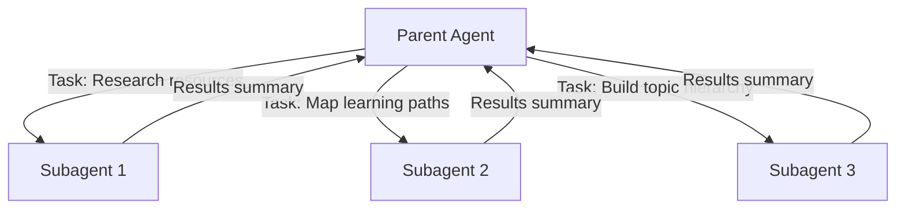

# Understanding Subagents: Isolated Workers

> **Key question**: How can an AI agent work on multiple things at once without getting confused?

## Context

Here is another behind-the-scenes reveal: when this curriculum was generated, the `/init` command did not write all 18 modules one at a time. It launched **three subagents in parallel** — each researching a different aspect of the curriculum simultaneously. One researched canonical resources, another mapped learning paths, and a third built the topic hierarchy. They worked independently, and their results were combined to create the curriculum you are working through.

Three subagents researched your curriculum in parallel. This module explains how that works.

## The Core Idea

A **subagent** is a separate Claude Code worker launched by the main agent to handle a specific sub-task. The key properties:

- **Isolated context**: Each subagent has its own context window. It cannot see the parent's conversation history.
- **Focused task**: Each subagent gets a specific prompt describing what to do.
- **Condensed return**: When a subagent finishes, it returns a summary to the parent. Not the full conversation — just the results.
- **Parallel execution**: Multiple subagents can run simultaneously.

Think of it like delegating work to a team. You (the parent agent) give each team member a specific task and relevant information. They go away, do their work independently, and report back with results. They do not know what the other team members are doing, and they do not share context.



## How It Works

### The Task Tool

Subagents are created using Claude Code's `Task` tool. The parent agent provides:

- **A prompt**: What the subagent should do
- **A subagent type**: What kind of worker to create (general-purpose, Explore, Bash, etc.)
- **Optional settings**: Whether to run in the background, maximum turns, etc.

The subagent launches, does its work using the same tools as the parent (Read, Write, Grep, etc.), and returns a result.

### Context Isolation

This is the most important concept. Each subagent starts with a fresh context window. It does not see:

- The parent's conversation history
- What other subagents are doing
- The accumulated context from earlier in the session

The subagent only knows what is in its prompt, what it reads from files, and what it discovers through tool use. This isolation is a feature, not a limitation:

1. **Prevents context contamination**: A subagent researching Python libraries will not be distracted by an unrelated conversation about CSS.
2. **Enables parallelism**: Because subagents do not share state, they can run simultaneously without conflicts.
3. **Protects the parent's context**: A subagent that reads 50 files does not dump all that content into the parent's context window. Only the summary comes back.

### Built-in Subagent Types

| Type | Speciality | Best For |
|------|-----------|----------|
| `general-purpose` | Full access to all tools | Complex, multi-step research tasks |
| `Explore` | Fast read-only codebase exploration | Finding files, understanding structure |
| `Bash` | Command execution | Running tests, builds, installations |
| `Plan` | Analysis without changes | Designing approaches, architecture |

### How This Curriculum Used Subagents

The `/init` command used subagents at several points:

1. **Research phase**: Three parallel subagents researched different aspects of the curriculum
2. **Curriculum generation**: The init command orchestrated subagents to research, design, and generate content

You can see this orchestration yourself. Check the init command:

```
Read the file .claude/commands/init.md and look for how it uses the Task tool.
```

The command file describes the multi-phase process: gather user input, research in parallel, design the curriculum, generate files. The research phase explicitly launches parallel subagents.

## Trade-offs and Alternatives

**Subagents vs doing everything sequentially**: Sequential work is simpler but slower. If three research tasks each take 30 seconds, sequential execution takes 90 seconds. Parallel subagents take ~30 seconds. The trade-off is complexity — orchestrating parallel work requires more careful prompt writing.

**Subagents vs putting everything in one context**: A single agent doing everything in one context window risks filling the window with irrelevant information. Subagents keep each task's context focused and lean.

**When NOT to use subagents**: If the tasks are interdependent (task B needs results from task A), subagents do not help — they need to run sequentially. Also, for very quick tasks, the overhead of launching a subagent is not worth it.

### The No-Nesting Rule

Subagents cannot launch their own subagents. The hierarchy is flat: parent launches subagents, subagents do work, subagents report back. This prevents runaway complexity and keeps the system predictable.

## Common Misconceptions

**"Subagents share memory with the parent."**
They do not. Each subagent has an isolated context window. It starts fresh, with only the prompt and whatever it reads from files. The parent does not see the subagent's intermediate work — only the final summary.

**"Subagents are always better for complex tasks."**
Not always. If a task requires building on accumulated context (understanding that develops over multiple steps), a single agent doing everything sequentially may produce better results. Subagents are best for independent, parallelisable work.

**"Subagents can do anything the parent can do."**
Almost — but with restrictions. Subagents typically have limited access to some tools (like Write, in some configurations). They also have their own permission requirements. The parent cannot bypass the user's permission settings by delegating to a subagent.

## Connections

In Module 4.4, you will build a command that uses subagents to do parallel work. In Module 4.5, the full architecture trace shows how subagents fit into the bigger picture of this project's design.

Understanding subagents also deepens the context engineering concepts from Section 3. Subagents are a practical solution to the attention budget problem — by isolating context into separate windows, you avoid the noise accumulation that degrades performance in long sessions.

## Knowledge Check

1. What happens to the context when a subagent finishes its task?
   - A) The entire context is merged into the parent's window
   - B) The context is shared with other running subagents
   - C) The context is saved to a file for later
   - D) Only a condensed summary is returned to the parent

2. In your own words, explain why context isolation is beneficial. Use the team delegation analogy to illustrate your point.

## Further Reading

- [Orchestrating Parallel Work](./4.4-orchestrating-parallel-work.md) — build a command that uses skills and subagents together
- [Signal, Noise, and the Attention Budget](../03-context-engineering/3.3-signal-noise-and-the-attention-budget.md) — the concept that makes context isolation valuable
