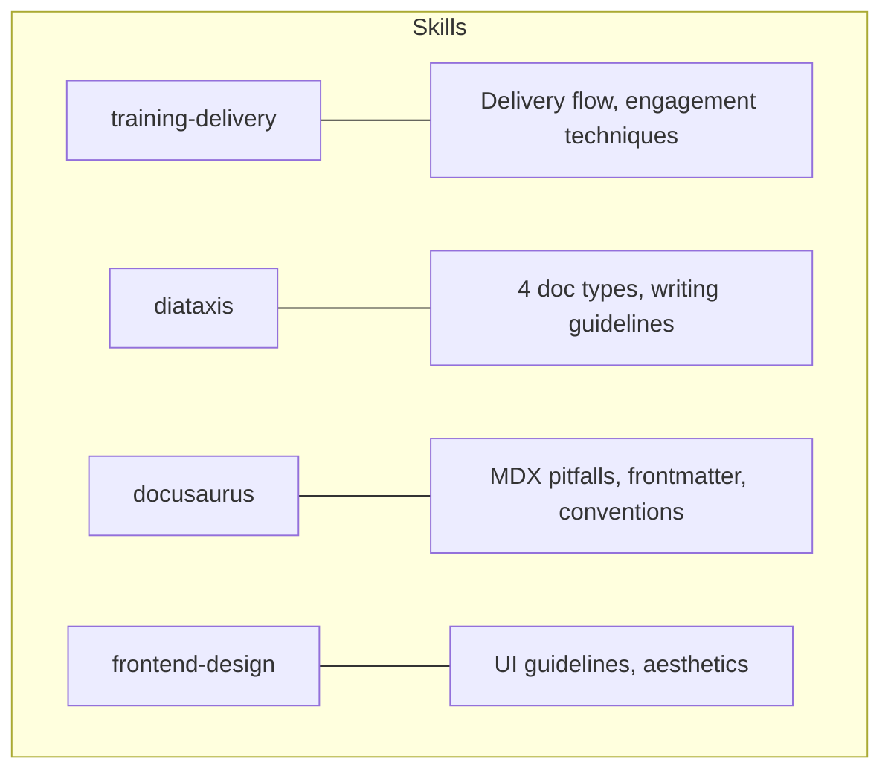
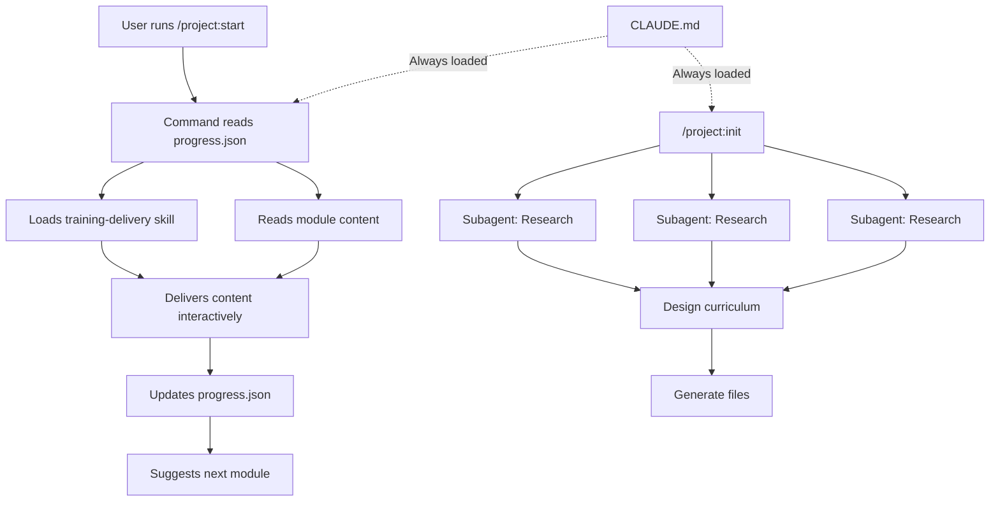

# Understanding the Full Architecture

> **Key question**: How do all the pieces — CLAUDE.md, skills, commands, subagents, and progress tracking — fit together to create a complete learning system?

## Context

You have spent 17 modules learning about GitHub, Claude Code, context engineering, skills, and subagents. Each concept was introduced individually. Now it is time to see how they all connect.

This module traces the complete architecture of the project you have been learning from. Every layer, every connection, every design decision. By the end, you will see the big picture: a system built from simple, composable pieces that together create something much more powerful than any individual part.

## The Core Idea

This learning project is a **context-engineered system built by context-engineered agents**. That sentence is the entire architecture in one line. Let us unpack it layer by layer.

## How It Works

### Layer 1: The Foundation — CLAUDE.md

Everything starts with `CLAUDE.md` in the project root. This file is loaded automatically in every Claude Code session. It establishes:

- **What this project is**: A personalised learning environment
- **How it is structured**: Directories, file naming, module IDs
- **How commands work**: Slash commands in `.claude/commands/`
- **How skills work**: Reference documents in `.claude/skills/`
- **How progress is tracked**: The `progress.json` schema

Without CLAUDE.md, Claude Code would see a collection of files with no understanding of how they relate. With it, every session starts with full architectural awareness.

### Layer 2: Specialist Knowledge — Four Skills

The skills provide deep knowledge for specific tasks:



- **training-delivery**: Loaded during every module delivery. Controls pacing, knowledge checks, engagement, and progression.
- **diataxis**: Loaded during content generation. Classifies each module (tutorial, explanation, how-to, reference) and provides writing guidelines for each type.
- **docusaurus**: Loaded during content generation. Prevents MDX compilation errors, ensures correct file naming and frontmatter.
- **frontend-design**: Loaded during landing page generation. Provides UI design guidelines.

Each skill is loaded only when needed. This keeps the base context lean while making specialist knowledge available on demand.

### Layer 3: The Interface — Command Launchers

Every module has a command launcher in `.claude/commands/`. When you run `/project:3-1-what-is-context`, the launcher file tells Claude Code:

1. Update `progress.json` to mark the module as in-progress
2. Read the module content file
3. Read the training-delivery skill
4. Read the skill's reference files
5. Deliver the content following the skill's procedures
6. Update progress on completion
7. Suggest next steps

The launchers are simple files — about 10 lines each. But they orchestrate a precise sequence: load the right content, load the right skill, track the state, and hand off to the teaching engine.

### Layer 4: The Generator — /project:init

The `/project:init` command is the most complex orchestrator. It:

1. **Gathers input**: Asks what you want to learn, your level, time commitment
2. **Researches**: Launches parallel subagents to find resources, map learning paths, and build a topic hierarchy
3. **Designs**: Creates the curriculum structure (sections, modules, types)
4. **Generates**: Creates all module content files, command launchers, category configs, and progress tracking
5. **Configures**: Sets up the Docusaurus site structure

This is where all the patterns converge. The init command uses:
- **CLAUDE.md** for project conventions
- **Diataxis skill** for content classification
- **Docusaurus skill** for file formatting
- **Frontend-design skill** for the landing page
- **Subagents** for parallel research
- **Progress.json** for state initialisation

### Layer 5: Structured State — progress.json

`progress.json` is the glue that holds sessions together. It stores:

```json
{
  "version": 1,
  "user": "",
  "topic": "Claude Code and Context Engineering",
  "modules": {
    "1.1": { "status": "completed", "started_at": "...", "completed_at": "..." },
    "1.2": { "status": "in_progress", "started_at": "..." },
    "1.3": { "status": "not_started" }
  }
}
```

This structured data is more effective than prose. Claude Code can read it, understand your progress, and make decisions (what to teach next, what to review) without parsing ambiguous text. It is context engineering applied to state management.

## The Big Picture



Here is the elegant part: you are learning context engineering **inside a context-engineered system** that was **built by context-engineered agents**. The META angle is not just a teaching gimmick — it is the most honest way to learn. You are not studying abstract theory. You are seeing the real thing, from the inside.

## Trade-offs and Alternatives

This architecture is not the only way to build a learning system. Alternatives include:

- **A single massive prompt**: Put everything in one file and let Claude figure it out. Simpler, but would hit context limits fast and produce inconsistent results.
- **A web application**: Build a traditional learning platform with a database, authentication, and a server. More robust, but orders of magnitude more complex.
- **A static document**: Write a tutorial as a PDF or website. No interactivity, no adaptation, no progress tracking.

The chosen architecture balances simplicity (markdown files, JSON state) with capability (interactive delivery, progress tracking, spaced repetition). Everything is human-readable and version-controlled. Nothing requires a server, a database, or an internet connection (beyond the AI API).

## Connections

This is the culmination module. Every concept from the curriculum connects here:

- **Section 1** (GitHub): The project is a Git repository. Changes are tracked. Content is version-controlled.
- **Section 2** (Claude Code): The agentic loop powers delivery. Tools read files and track state.
- **Section 3** (Context Engineering): CLAUDE.md, skills, and structured JSON are all context engineering techniques.
- **Section 4** (Skills & Subagents): The teaching engine, content generation, and parallel research all use the patterns you learned.

## Knowledge Check

1. What role does CLAUDE.md play in the overall architecture?
   - A) It stores the user's learning progress
   - B) It provides the foundational context for every Claude Code session in this project
   - C) It contains the content of all modules
   - D) It runs the subagents

2. In your own words, trace what happens from the moment you run `/project:start` to the moment a module is delivered. Name each component involved and its role.

## Further Reading

- [Agentic Patterns Cheat Sheet](./4.6-agentic-patterns-cheat-sheet.md) — quick reference for all the patterns used in this architecture
- [What Is Context?](../03-context-engineering/3.1-what-is-context.md) — revisit the foundational concept with new understanding
